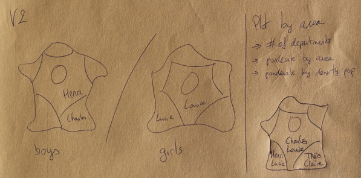

# IGR204

## Visualization 1 (Celio/Marie/Servane)

Plot a 'value' for each name in histogram. The value is determined by a slider e.g. can be mean, standard deviation, .. and the period where the values associated with the name are taken into account is set by the user. This enable comparison between the different years.

## Visualization 2 (Arthur)

Two visualizations :

A map of France with in each region the more popular name for boys / girls. One color by name.

Curve plotting the value associated with the name at each year. One curve by region. The user can select which region to plot.

## Visualization 3 (Jean-Loup)

Histogram of the proportion of people names. They are ordered by popularity. At each x is associate the proportion for boys and girls in two distinct colors.

## How to run the visualizations

Each part is in the viz_i.ipynb respectively. The final choice is in the last cell. Please be sure that the following modules are installed:
- ipywidget
- ipython
- toolz
- pandas
- geopandas
- altair

You can install them with pip or conda.
